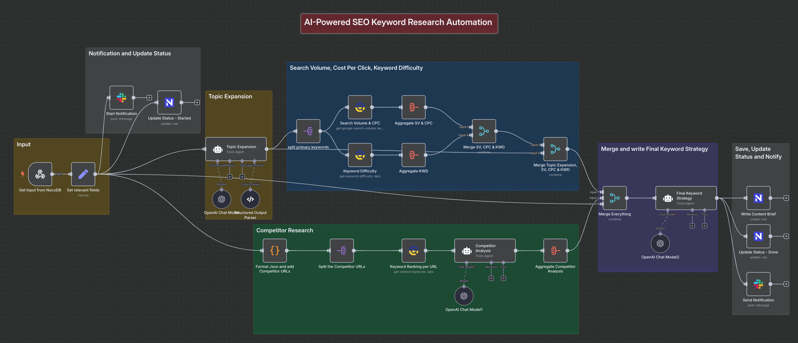
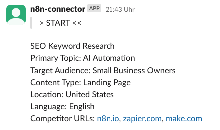
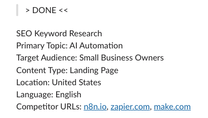

# AI-Powered SEO Keyword Research Workflow

This is one part of a larger content rearch / SEO workflow I built for a client. It's incredibly effective for automating keyword research: you throw in a topic, it analyzes potential keywords, it outputs a complete keyword strategy with search volumes, difficulty scores, competitor analysis, etc.

## Table of Contents

1. [Introduction](#introduction)
2. [Workflow Architecture](#workflow-architecture)
3. [NocoDB Integration](#nocodb-integration)
4. [Data Flow](#data-flow)
5. [Core Components](#core-components)
6. [Setup Requirements](#setup-requirements)
7. [Possible Improvements](#possible-improvements)

## Introduction

Here's how it works: You send a webhook from NocoDB with your main topic and some competitor URLs. The workflow then uses OpenAI to brainstorm related keywords, hits up DataForSEO to get all the search metrics (volume, CPC, difficulty), analyzes what your competitors are ranking for, and finally creates a complete content strategy. It's like having an SEO expert on autopilot.

## Workflow Architecture

Here's what happens step by step:

1. **Input Collection**: Receives data via webhook from NocoDB
2. **Topic Expansion**: Generates keywords using AI
3. **Keyword Metrics Analysis**: Gathers search volume, CPC, and difficulty metrics
4. **Competitor Analysis**: Analyzes competitor content for ranking keywords
5. **Final Strategy Creation**: Combines all data to generate a comprehensive keyword strategy
6. **Output Storage**: Saves results back to NocoDB and sends notifications

```mermaid
flowchart TD
    A[Webhook Input from NocoDB] --> B[Set Relevant Fields]
    B --> C[Start Notification - Slack]
    B --> D[Update Status: Started]
    B --> E[Topic Expansion - OpenAI]
    B --> F[Format JSON & Competitor URLs]

    E --> G[Split Primary Keywords]
    G --> H[Search Volume & CPC - DataForSEO]
    G --> I[Keyword Difficulty - DataForSEO]

    H --> J[Aggregate SV & CPC]
    I --> K[Aggregate KWD]
    J --> L[Merge SV, CPC & KWD]

    L --> M[Merge Topic Expansion with Metrics]
    E --> M

    F --> N[Split Competitor URLs]
    N --> O[Keyword Ranking per URL - DataForSEO]
    O --> P[Competitor Analysis - OpenAI]
    P --> Q[Aggregate Competitor Analysis]

    M --> R[Merge Everything]
    Q --> R
    B --> R

    R --> S[Final Keyword Strategy - OpenAI]
    S --> T[Write Content Brief to NocoDB]
    S --> U[Update Status: Done]
    S --> V[Send Completion Notification - Slack]
```

## NocoDB Integration

### Database Structure

The workflow integrates with two tables in NocoDB:

#### Input Table Schema

This table collects the input parameters for the keyword research:

| Field Name      | Type          | Description                                                                 |
| --------------- | ------------- | --------------------------------------------------------------------------- |
| ID              | Auto Number   | Unique identifier                                                           |
| Primary Topic   | Text          | The main keyword/topic to research                                          |
| Competitor URLs | Text          | Comma-separated list of competitor websites                                 |
| Target Audience | Single Select | Description of the target audience (Solopreneurs, Marketing Managers, etc.) |
| Content Type    | Single Select | Type of content (Blog, Product page, etc.)                                  |
| Location        | Single Select | Target geographic location                                                  |
| Language        | Single Select | Target language for keywords                                                |
| Status          | Single Select | Workflow status (Pending, Started, Done)                                    |
| Start Research  | Checkbox      | Active Workflow when you set this to true                                   |

#### Output Table Schema

This table stores the generated keyword strategy:

| Field Name         | Type        | Description                                      |
| ------------------ | ----------- | ------------------------------------------------ |
| ID                 | Auto Number | Unique identifier                                |
| primary_topic_used | Text        | The topic that was researched                    |
| report_content     | Long Text   | The complete keyword strategy in Markdown format |
| generatedAt        | Datetime    | Automatically generated by NocoDb                |

### Webhook Settings

NocoDB Webhook Settings

## Data Flow

The workflow handles data in the following sequence:

1. **Webhook Trigger**: Receives input from NocoDB when a new keyword research request is created
   
2. **Field Extraction**: Extracts primary topic, competitor URLs, audience, and other parameters
3. **AI Topic Expansion**: Uses OpenAI to generate related keywords, categorized by type and intent
4. **Keyword Analysis**: Sends primary keywords to DataForSEO to get search volume, CPC, and difficulty
5. **Competitor Research**: Analyzes competitor pages to identify their keyword rankings
6. **Strategy Generation**: Combines all data to create a comprehensive keyword strategy
7. **Storage & Notification**: Saves the strategy to NocoDB and sends a notification to Slack
   

## Core Components

### 1. Topic Expansion

This component uses OpenAI and a structured output parser to generate:

- 20 primary keywords
- 30 long-tail keywords with search intent
- 15 question-based keywords
- 10 related topics

### 2. DataForSEO Integration

Two API endpoints are used:

- **Search Volume & CPC**: Gets monthly search volume and cost-per-click data
- **Keyword Difficulty**: Evaluates how difficult it would be to rank for each keyword

### 3. Competitor Analysis

This component:

- Analyzes competitor URLs to identify which keywords they rank for
- Identifies content gaps or opportunities
- Determines the search intent their content targets

### 4. Final Keyword Strategy

The AI-generated strategy includes:

- Top 10 primary keywords with metrics
- 15 long-tail opportunities with low competition
- 5 question-based keywords to address in content
- Content structure recommendations
- 3 potential content titles optimized for SEO

## Setup Requirements

To use this workflow, you'll need:

1. **n8n Instance**: Either cloud or self-hosted
2. **NocoDB Account**: For data input and storage
3. **API Keys**:
   - OpenAI API key
   - DataForSEO API credentials
   - Slack API token (for notifications)
4. **Database Setup**: Create the required tables in NocoDB as described above

## Possible Improvements

The workflow could be enhanced with the following improvements:

### Enhanced Keyword Strategy

- Add topic clustering to group related keywords
- Enhance the final output with more specific content structure suggestions
- Include word count recommendations for each content section

### Additional Data Sources

- Integrate Google Search Console data for existing content optimization
- Add Google Trends data to identify rising topics
- Include sentiment analysis for different keyword groups

### Improved Competitor Analysis

- Analyze content length and structure from top-ranking pages
- Identify common backlink sources for competitor content
- Extract content headings to better understand content organization

### Automation Enhancements

- Add scheduling capabilities to run updates on existing content
- Implement content performance tracking over time
- Create alert thresholds for changes in keyword difficulty or search volume

---

## Example Output

Here is an example Output the Workflow generated based on the following inputs:

- Primary Topic: `AI Automation`
- Competitor URLs: `n8n.io, zapier.com, make.com`
- Target Audience: `Small Business Owners`
- Content Type: `Landing Page`
- Location: `United States`
- Language: `English`

**Output**: [Final Keyword Strategy ](./Final_Keyword_Strategy-AI_Automation.md)

---

The best part? Once you set it up, it just runs. No more hours spent manually researching keywords or trying to figure out what your competitors are doing. Just feed it a topic and let it work its magic.

You can also find this workflow in the n8n template library if you want the official version: [Comprehensive SEO Keyword Research with OpenAI & DataForSEO Analytics to NocoDB](https://n8n.io/workflows/3908-comprehensive-seo-keyword-research-with-openai-and-dataforseo-analytics-to-nocodb/)
