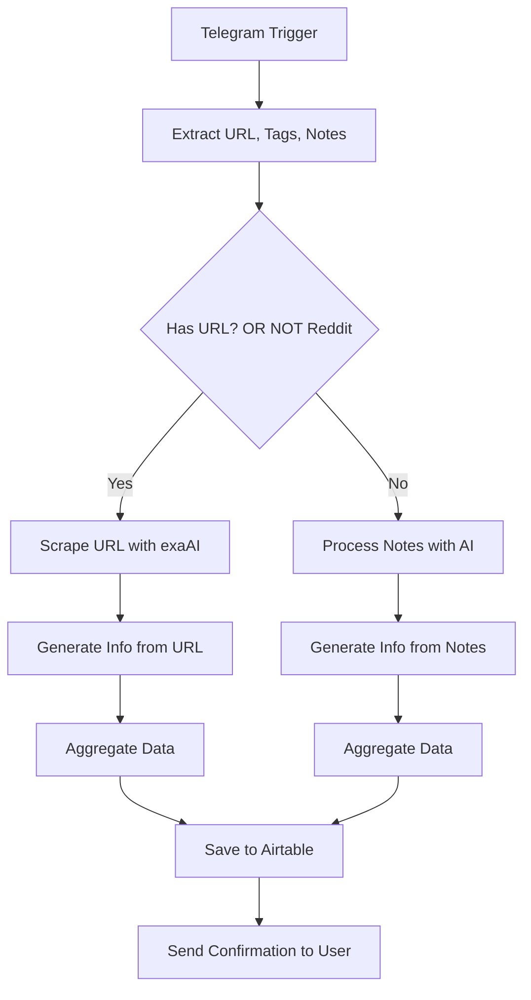

# Link Capture System

So I was tired of losing interesting links I'd find throughout the day. This workflow fixes that - it captures links from Telegram, uses AI to figure out what they're about, and saves everything to Airtable. It's basically like having a smart bookmark manager that actually understands your content.

## Overview

Here's the deal: you send a link (or just a note) to a Telegram bot, and it automatically extracts the main points, generates a summary, pulls out good quotes, and even suggests content ideas based on what it finds. Everything gets organized in Airtable so you can actually find it later.

## Features

- Capture URLs, notes, and hashtags from Telegram messages
- Extract content from URLs using exaAI (with special handling for Reddit links)
- Process content using AI to identify:
  - Title
  - Summary
  - Tags
  - Content type
  - Notable quotes
  - Content ideas
  - Automation ideas
- Store all information in Airtable
- Send a confirmation message back to the user with key insights

## How It Works

1. Send a message to your Telegram bot
2. The workflow grabs any URLs, hashtags, or notes from your message
3. If there's a URL, it scrapes the content (using exaAI)
4. AI analyzes everything and extracts the good stuff
5. Everything gets saved to Airtable
6. You get a nice summary back in Telegram

## Workflow Diagram

## Components

### Input

- **Telegram Trigger**: Listens for messages from users
- **Code Node**: Extracts URLs, tags, and notes from messages

### Processing

- **exaAI**: Scrapes content from URLs
- **OpenAI Chat Model**: Processes content to extract information
- **Structured Output Parser**: Formats AI responses into structured data

### Storage

- **Airtable**: Stores all processed information in a structured database

### Notification

- **Telegram Bot**: Replies to the user with a summary of the extracted information

## Heads Up

- Reddit links can be a bit wonky (their anti-scraping is tough)
- Sometimes the scraper fails on certain sites
- Could probably use better error handling, but it works well enough

## Usage

1. Send a link or note to the Telegram bot
2. Optionally include hashtags for tagging
3. Wait for the bot to process and respond
4. Check Airtable for the stored information

## Airtable Schema

| Column Name     | Type        |
| --------------- | ----------- |
| Name            | Single Text |
| Notes           | Long Text   |
| URL             | url         |
| Tags            | Single Text |
| Created         | ISO Date    |
| Content Type    | Single Text |
| Quote           | Single Text |
| Content Idea    | Long Text   |
| Automation Idea | Long Text   |
| Summary         | Long Text   |

## That's It!

Pretty straightforward - just a simple way to never lose interesting content again. The AI part is what makes it really useful since it actually understands what you're saving, not just storing raw links.
