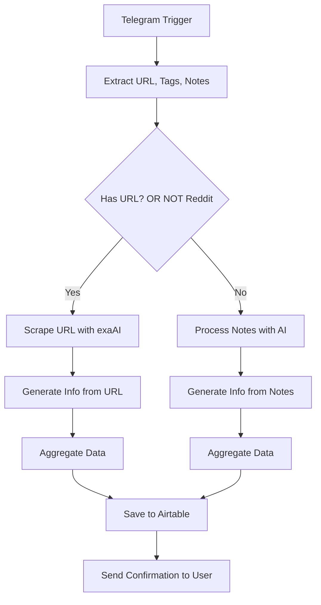

# Intelligent Link Capture & Analysis System

Streamline your knowledge management with this sophisticated workflow that automatically captures, analyzes, and organizes valuable content from Telegram. Transform scattered links and notes into actionable insights with AI-powered content extraction and intelligent categorization.

## Overview

Never lose valuable content again! This automated system acts as your personal research assistant, intelligently processing every link and note you share. It goes beyond simple bookmarking by extracting deep insights, identifying key themes, and generating creative ideas from your collected content.

## Features

- Capture URLs, notes, and hashtags from Telegram messages
- Extract content from URLs using exaAI (with special handling for Reddit links)
- Process content using AI to identify:
  - Title
  - Summary
  - Tags
  - Content type
  - Notable quotes
  - Content ideas
  - Automation ideas
- Store all information in Airtable
- Send a confirmation message back to the user with key insights

## How It Works

1. A message is received by the Telegram bot
2. The system extracts URLs, hashtags, and notes
3. If a URL is present, it's scraped using exaAI
4. The content (from URL or notes) is analyzed by AI
5. Results are saved to Airtable
6. A summary is sent back to the user

## Workflow Diagram

## Components

### Input

- **Telegram Trigger**: Listens for messages from users
- **Code Node**: Extracts URLs, tags, and notes from messages

### Processing

- **exaAI**: Scrapes content from URLs
- **OpenAI Chat Model**: Processes content to extract information
- **Structured Output Parser**: Formats AI responses into structured data

### Storage

- **Airtable**: Stores all processed information in a structured database

### Notification

- **Telegram Bot**: Replies to the user with a summary of the extracted information

## Limitations & Improvements

- Reddit links currently have some processing issues
- Error handling could be improved
- Alternative scraping methods could be implemented for problematic sites

## Usage

1. Send a link or note to the Telegram bot
2. Optionally include hashtags for tagging
3. Wait for the bot to process and respond
4. Check Airtable for the stored information

## Airtable Schema

| Column Name     | Type        |
| --------------- | ----------- |
| Name            | Single Text |
| Notes           | Long Text   |
| URL             | url         |
| Tags            | Single Text |
| Created         | ISO Date    |
| Content Type    | Single Text |
| Quote           | Single Text |
| Content Idea    | Long Text   |
| Automation Idea | Long Text   |
| Summary         | Long Text   |

## Start Building Your Knowledge System

Transform how you capture and process information with workflow automation:
[Discover n8n](https://n8n.io/)
