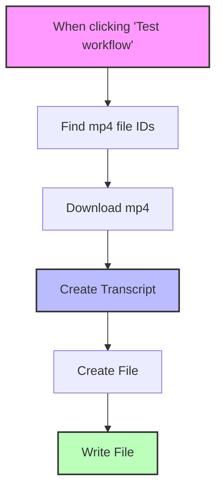

# Video to Text with ElevenLabs

This workflow is a lifesaver if you have a bunch of videos that need transcribing. It automatically grabs MP4s from your Google Drive, runs them through ElevenLabs' speech-to-text API, and saves the transcripts as Google Docs. No more manual transcription!

## Prerequisites

- n8n instance
- Google Drive account credentials
- Google Docs account credentials
- ElevenLabs API key

## Setup

1. Import the workflow JSON file into n8n
2. Configure credentials:
   - Connect Google Drive account
   - Connect Google Docs account
   - Create an ElevenLabs API key credential
3. In the "Find mp4 file IDs" node, replace 'PARENT FOLDER ID' with your actual Google Drive folder ID containing the videos
4. Optionally, adjust the folder ID in the "Create File" node where transcripts will be stored

## How It Works

1. **Trigger**: Just click "Test workflow" to start
2. **Find Videos**: Looks for MP4 files in your specified Google Drive folder (processes up to 10 at a time)
3. **Download**: Grabs each video file
4. **Transcribe**: Sends it to ElevenLabs for transcription
5. **Create Document**: Makes a new Google Doc named "Transcript-[your video name]"
6. **Write Content**: Dumps the transcription into the doc

## Workflow Diagram

## Good to Know

- Videos are processed one at a time (not in parallel)
- Transcription quality is pretty good, but depends on audio clarity
- The workflow automatically strips the .mp4 extension from doc titles so they look cleaner
- ElevenLabs handles most accents pretty well
